## LDTS_project-l01gr03 - CASTAWAY CHRONICLES

### Table of contents

 Click to expand.

* [How to play](#-how-to-play)
* [Implemented features](#-implemented-features)
* [Planned features](#planned-features)
* [Future work](#future-work)
* [UML](#uml)
* [Design](#design)
  * [MVC](#-architectural-pattern)
  * [Facade](#-use-of-a-library-with-unnecessary-methods)
  * [Factory Method](#-return-objects-of-different-classes)
  * [Factory](#-use-of-condicionals-when-instatiating-concrete-classes)
  * [State](#-different-class-use-depending-on-the-application-state)
  * [State](#-different-actions-response-depending-on-the-application-state)
  * [Command](#-save-user-input-to-be-processed-only-after-a-certain-action-finishes)
  * [Observer](#-get-user-input)
  * [Game loop](#-control-game-pace)
* [Known code smells](#-known-code-smells)
* [Testing](#-testing)
* [Self-evaluation](#self-evaluation)

**Our project**:

In this exciting game you arrive at an isolated island after a ship wreck and you receive unsettling news, what are you going to do?

This project was developed by *Bruno Aguiar* (*up202205619*@fe.up.pt), *Francisco Fernandes* (*up202208485*@fe.up.pt) and *Lara Coelho* (*up202208689*@fe.up.pt) for LDTS 2023⁄24.

### 🏁 HOW TO PLAY

Controls in Menus
- `UP` Move to option above
- `DOWN` Move to option down
- `LEFT` Move to option left
- `RIGHT` Move to option right
- `ENTER` Select current option

Controls in Scenes
- `CLICK` Walk and select an object

Controls with Text box
- `ENTER` Next speech

Controls in Text box with choice
- `UP` Move to option above
- `DOWN` Move to option down
- `ENTER` Select current choice

### ☑ IMPLEMENTED FEATURES

 Walking main character.

 Map with clickable icons for different locations.

 Backpack with the items the player picked up.

 Interactable elements.

 Pickable items.

 Choice making in dialogs and backpack items.

 Different endings and depending on user choices. 🚩spoiler alert

 Text Display.

 Main menu.

 Page with achieved endings. 🚩spoiler alert

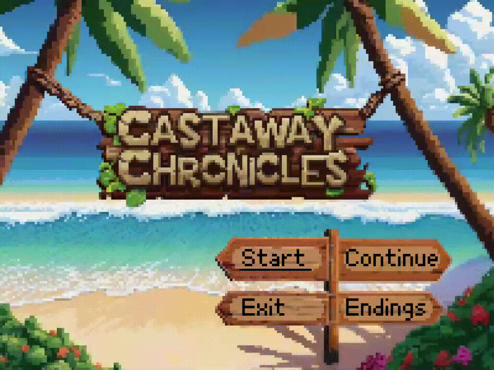

 Save and continue game.

 Pause menu.

### PLANNED FEATURES

- We implemented all the planned features.

### FUTURE WORK

- Use of JSON to read objects and story from.
- Add background music to the game and menus.
- Add sound effects for interactions.

### UML

### DESIGN

#### 🔵 ARCHITECTURAL PATTERN

**Problem in Context**

How to organize our code into functional segments and achieve reusability.

**The Pattern**

We have applied the **MVC** (Model-View-Controller) compound pattern. This pattern allows us to factore our code into funcional segments. It combines different patterns into an effective solution for our problem.

- The **Model** is responsible for mantaining all the data, state and any application logic. It's oblivious to the view and controller but it can provide methods to manipulate and retrieve its state and send notifications of state changes to observers.

- The **View** is responsible for presenting the model, usually gets the state and data it need directly from the model. It's an user interface.

- The **Controller** is responsible for taking user input and figuring out what it means to the model.

**Implementation**

The following UML diagram shows how we implemented this compound pattern.

**Consequences**

The use of the MVC compound pattern allowed us to organize and structure our code. 

#### 🔵 USE OF A LIBRARY WITH UNNECESSARY METHODS

**Problem in Context**

The library we use to create our text-based terminal GUI is Lanterna. This is a complex library that includes methods we do not need and sometimes requires long segments of code to render an object on screen, therefore making our code harder to read and maintain. The same happens with the libraries used to read and write to files.

**The Pattern**

We have used the **Facade Pattern**. A facade is a class that provides a simple interface to a complex subsystem which contains lots of moving parts. Although it might provide limited functionality in comparison to working with the subsystem directly, it includes only the features we really care about.

**Implementation**

[Lanterna GUI class](../src/main/java/castaway_chronicles/gui/LanternaGUI.java)
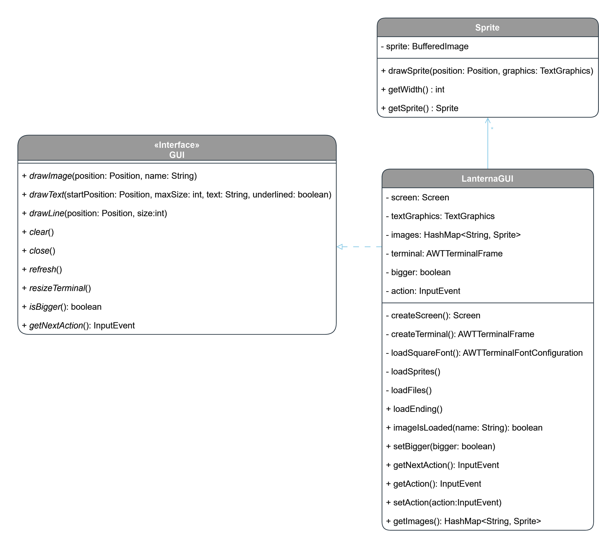
[Resource Manager class](../src/main/java/castaway_chronicles/ResourceManager.java)

**Consequences**

We make our code more readable and can adapt the functions provided by Lanterna to our program as we desire.

#### 🔵 RETURN OBJECTS OF DIFFERENT CLASSES

**Problem in Context**

We need methods such as getController() and getViewer() to return objects of different classes.

**The Pattern**

We have used the **Factory Method Pattern**.This Design Pattern defines an "interface" for creating an object, but lets subclasses decide which class to instantiate.

**Implementation**

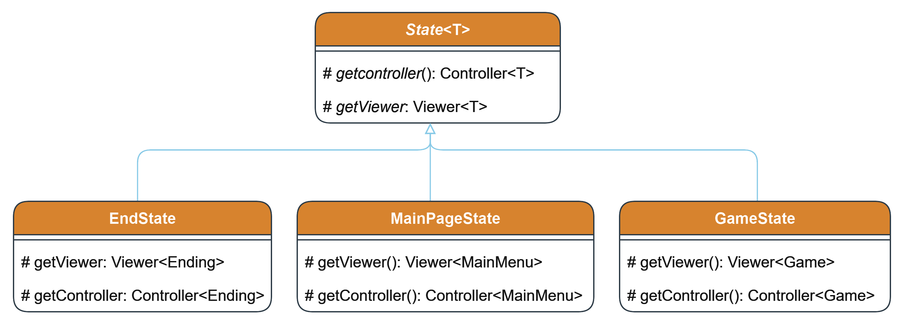

#### 🔵 USE OF CONDICIONALS WHEN INSTATIATING CONCRETE CLASSES

**Problem in Context**

We had to use conditionals to decide which concrete class we wanted to instantiate. However, this becomes a problem when we want to add and remove concrete classes.

**The Pattern**

We have used the **Factory Pattern**. This pattern takes out the responsibility of the instantiation of a class from our program to the factory class.

**Implementation**

[View code Scene Factory](../src/main/java/castaway_chronicles/model/game/scene/SceneFactory.java)

[View code Interactable Factory](../src/main/java/castaway_chronicles/model/game/gameElements/GameInteractableFactory.java)

**Consequences**

The use of the Factory design pattern allows us to encapsulate object creation, hiding the instantiation logic from the client, and achieve a more decoupled and flexible design.

#### 🔵 DIFFERENT CLASS USE DEPENDING ON THE APPLICATION "STATE"

**Problem in Context**

The concrete implementation viewer and controller used at a specific moment of application depends on the current state of the model.

**The Pattern**

We have used the **State Pattern** to solve this problem. This pattern allows an object to alter its behaviour when its internal state changes.

**Implementation**

[States](../src/main/java/castaway_chronicles/states)

**Consequences**

We can have different states in our game, such as main page, game and end, and change between them whenever desired.

#### 🔵 DIFFERENT ACTIONS RESPONSE DEPENDING ON THE APPLICATION "STATE"

**Problem in Context**

We need the program to "react" differently to user input depending on the current scene/state of the application.

**The Pattern**

We have used the **State Pattern** again to solve this problem. This pattern allows an object to alter its behaviour when its internal state changes.

**Implementation**

It has an implementation slightly different from the one used previously.

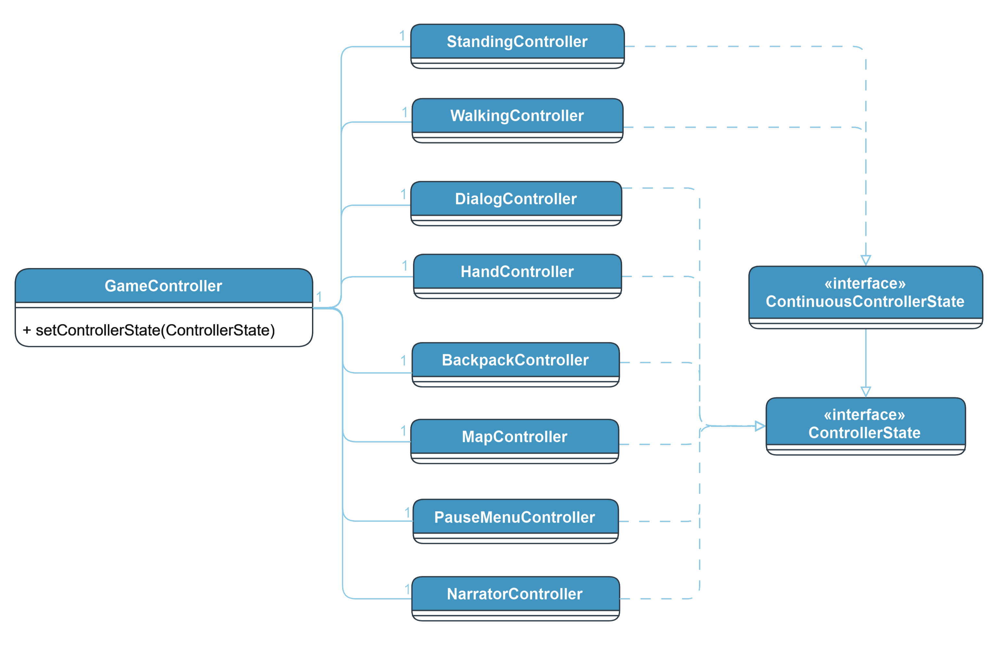

**Consequences**

The same input can lead to different actions depending on the controller state.

#### 🔵 SAVE USER INPUT TO BE PROCESSED ONLY AFTER A CERTAIN ACTION FINISHES

**Problem in Context**

We wanted the main character to pick up an object, talk to a NPC or go to a different location only after it had walked to it.

**The Pattern**

We applied the **Command Pattern**. This design pattern encapsulates a request as an objects, thereby letting us parameterize other objects with different requests, queue or log requests (also supports undoable operations, but we don't need this feature in our game).

**Implementation**

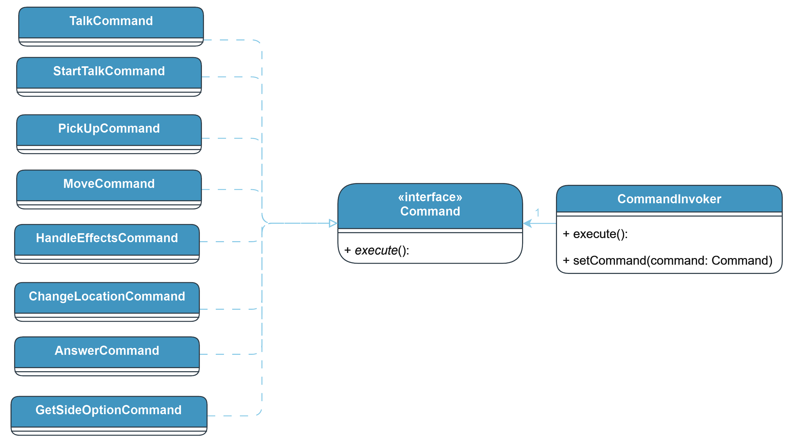

**Consequences**

We can perform the consequences of a action at any time in the game, does not need to be at the moment the action was performed.

#### 🔵 GET USER INPUT

**Problem in Context**

We need to get the actions, such as clicks and pressed keys, from the user interface.

**The Pattern**

We used the **Observer Pattern**. It defines a one-to-many dependency between objects so that when one object changes state (in this case, due to a click or key action), all its dependents are notified and updated automatically (our program).

**Implementation**

We added observers (Mouse and Key Listeners) to our terminal so that when an action is detected we are duly notified.
[Listeners in create Terminal method](../src/main/java/castaway_chronicles/gui/LanternaGUI.java)

**Consequences**

Our program can be notified of when a user performs an action and what action it was.

#### 🔵 CONTROL GAME PACE

**Problem in Context**

We want to control how fast the game runs.

**The Pattern**

We used the **Game Loop Pattern**. It allows us to decouple the progression of game time from user input and processor speed. We can simulate frequently and render when possible.

**Implementation**

[Game Loop](../src/main/java/castaway_chronicles/Application.java)

**Consequences**

Our game will probably have the same pace in computers with different processors, we have a constant loop waiting for user input and rendering our game.

#### 🔵 SEVERAL CLASSES NEED ACCESS TO FILES

**Problem in Context**

Once our game is built based on files, several classes needed access to them. We needed to control the access to this shared resource.

**The Pattern**

We used the **Singleton Pattern**. This pattern allows us to be sure that a class has only a single instance, gaining a global access point to it. Furthermore, the object is initialized only when it’s requested for the first time.

**Implementation**

[Resource Manager class](../src/main/java/castaway_chronicles/ResourceManager.java)

#### 🛑 KNOWN CODE SMELLS

Even though we tried to avoid making some of these code smells, we still have methods and classes larger than desired.
We also tried to avoid long parameter list, but considered it necessary in the Game constructor.

### ✅ TESTING

**Coverage Report**
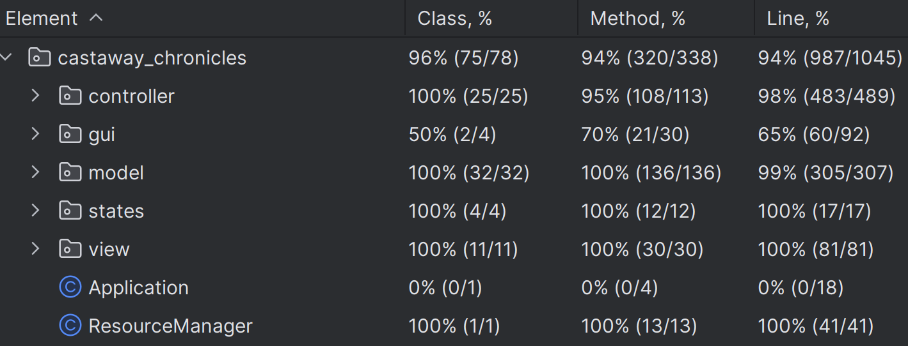
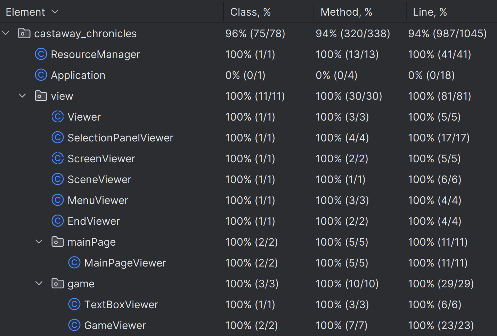
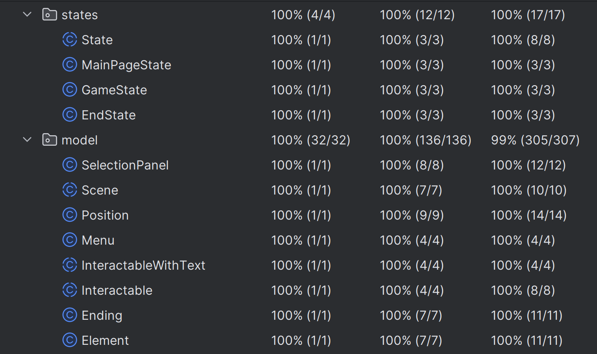
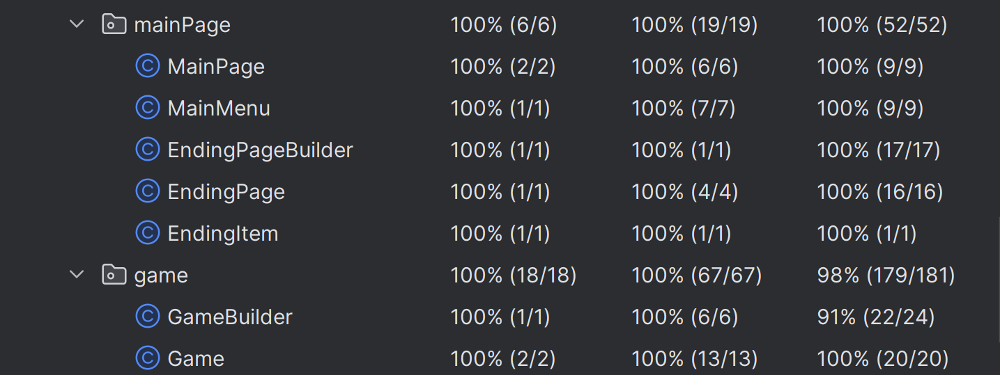
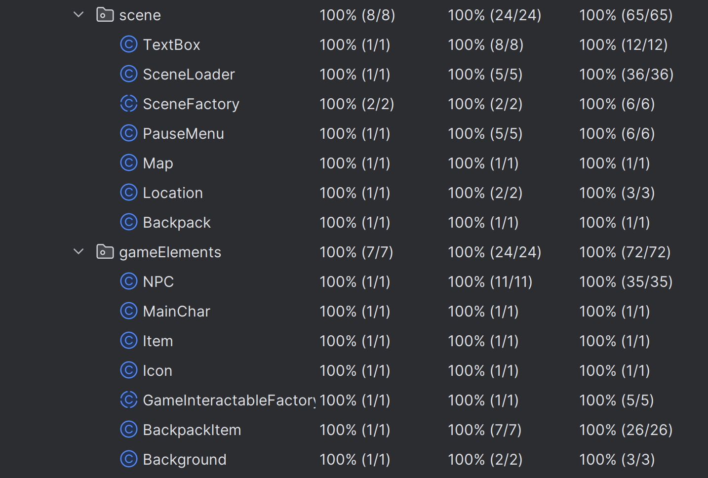
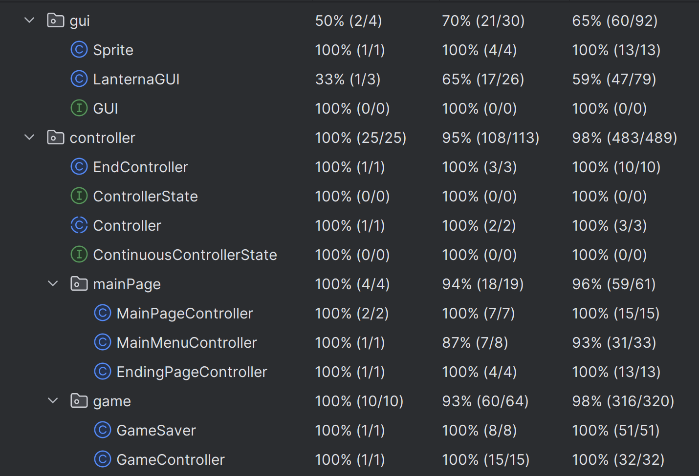
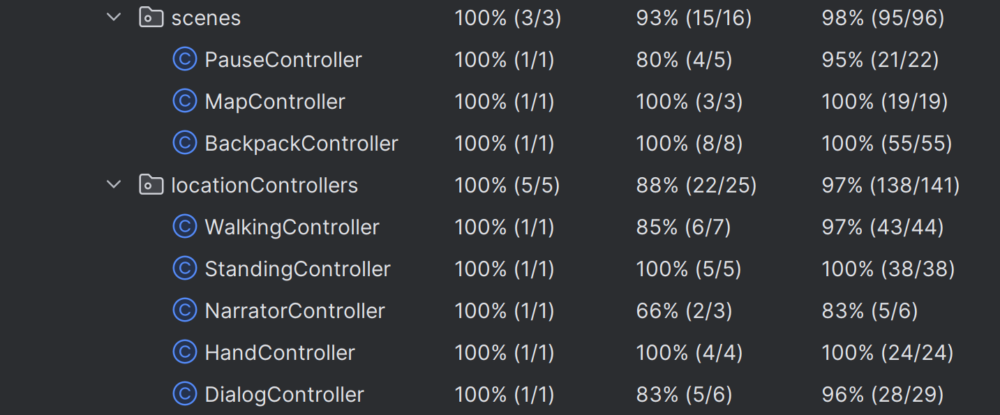
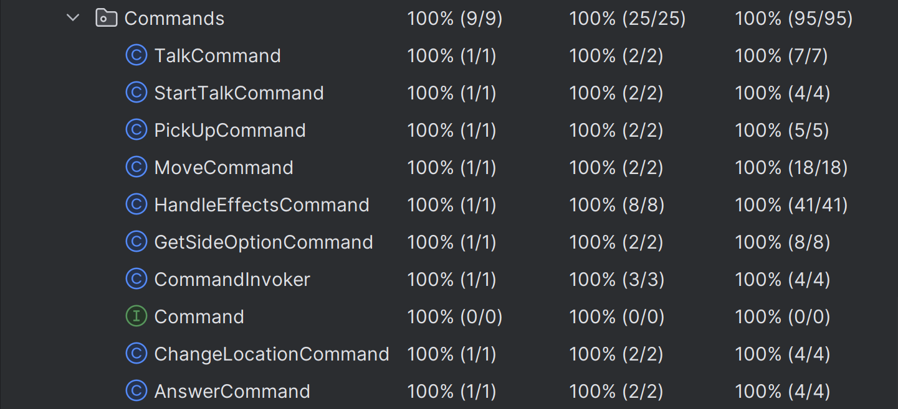

**Mutation testing report**
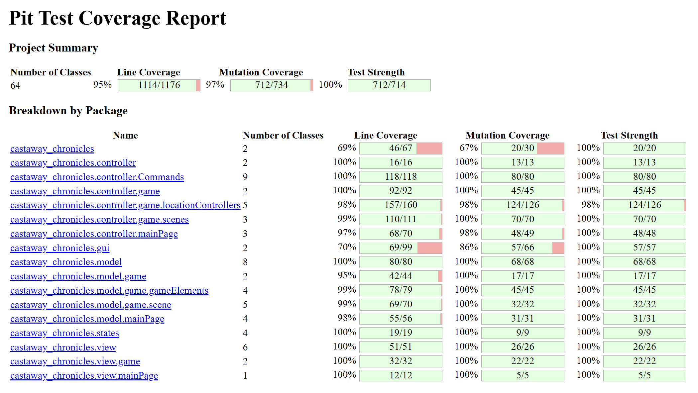
[Pitest folder](pitest)

### SELF-EVALUATION

**Division of work**:

- Bruno: 33,3333%
- Francisco: 33,3333%
- Lara: 33,3333%
